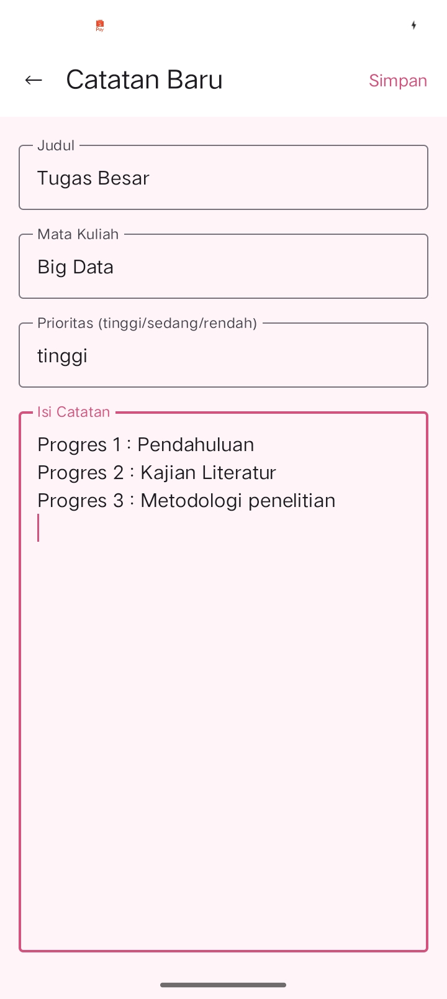

## Memory Simanjuntak
## 123140095

### Database Schema

| Column       | Type    | Description |
|-------------|--------|------------|
| id          | INTEGER | Primary key (auto increment) |
| title       | TEXT    | Judul catatan (wajib diisi) |
| content     | TEXT    | Isi catatan (wajib diisi) |
| subject     | TEXT    | Kategori/topik catatan (opsional) |
| priority    | TEXT    | Prioritas (low / medium / high) |
| created_at  | INTEGER | Waktu dibuat (timestamp dalam milliseconds) |
| updated_at  | INTEGER | Waktu terakhir diperbarui |

## Penjelasan Desain
-  menggunakan auto increment untuk identifikasi unik setiap note
- created_at dan updated_at disimpan dalam bentuk epoch time (Long) agar mudah untuk sorting dan filtering
- subject dan priority bersifat opsional untuk fleksibilitas data
- updated_at digunakan sebagai dasar sorting terbaru (recent changes)

## Queries yang Digunakan
- selectAll → Mengambil semua catatan berdasarkan waktu dibuat (terbaru di atas)
- selectAllByUpdated → Mengambil semua catatan berdasarkan waktu update (dipakai untuk fitur sort)
- selectById → Mengambil satu catatan berdasarkan ID
- insert → Menambahkan catatan baru
- update → Memperbarui isi catatan dan timestamp
- delete → Menghapus catatan
- search → Mencari catatan berdasarkan title atau content

### Screenshot Tampilan
## Home

## Create

## Read

## Search

## Settings

## Dark Light

